# Jenkins
* Jenkins is a self-contained, java-based-open source automation server which can be used to automate all sorts of tasks related to building, testing, and delivering or deploying software. 
## Before And After Jenkins

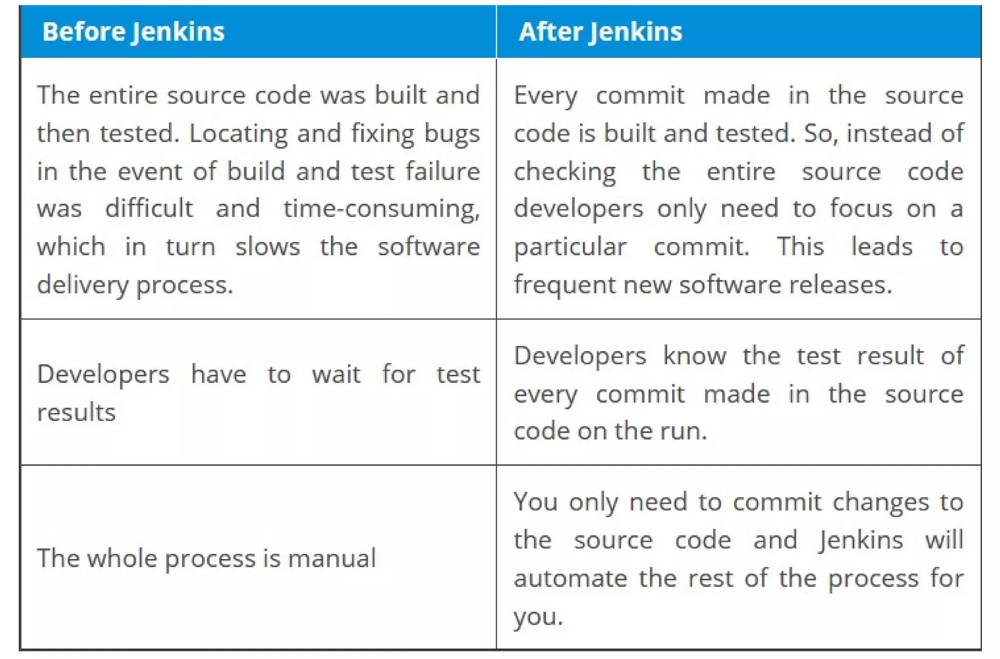

## Continuous Integration and Continuous Delivery/Deployment(CI/CD)
**Continuous Integration (CI):** This is the practice of frequently integrating code changes into a shared repository, ideally several times a day. Each integration is automatically verified by building the project and running automated tests. This helps to catch and fix errors quickly, maintain a high quality of code, and speed up the software development process.

**Continuous Delivery (CD):** This extends CI by automatically deploying all code changes to a testing or staging environment after the build stage. The aim is to have a codebase that is always in a deployable state, allowing teams to release new changes to customers quickly and safely at any time.

**Continuous Deployment (another CD):** This goes one step further than Continuous Delivery. Every change that passes through all the stages of your production pipeline is released to customers without manual intervention. The difference between Continuous Delivery and Continuous Deployment is mainly the automatic release to production.

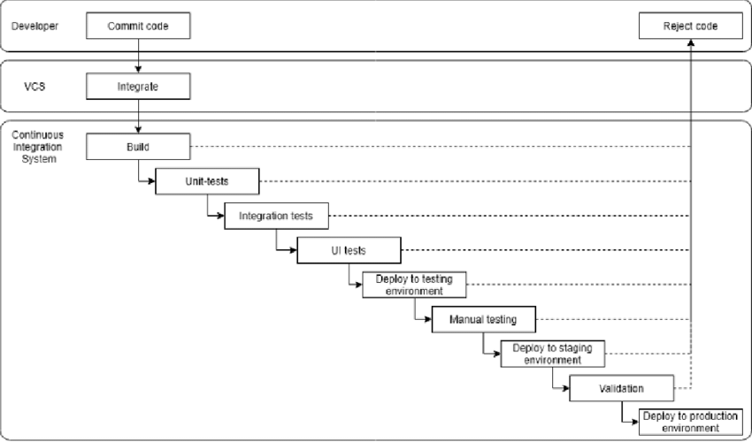

## Feature of Jenkins
 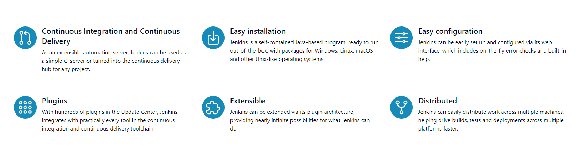

### Installing Jenkins in EC2 Instance.
* Create an EC2 instance of Ubuntu flavour(linux OS).In security groups allow 22 and 8080.
* Jenkins runs on 8080 port.

    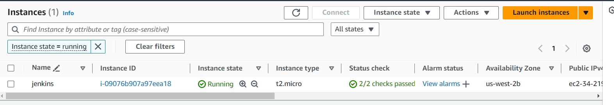

* Jenkins need minimum java-17.So we have to install java-17 or above.
  
    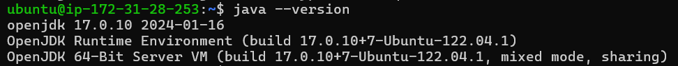

* [Refer Here](https://www.jenkins.io/doc/book/installing/) for installation 
* Select the required 

    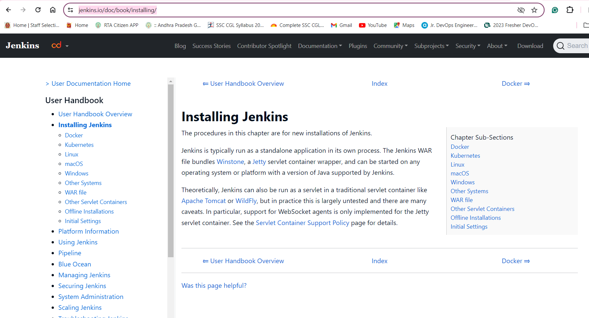
    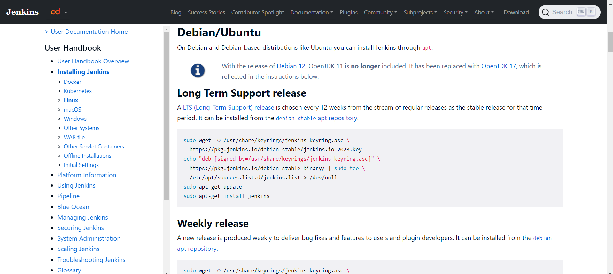

* After Installing Jenkins we can see jenkins page by entering `http://<publicip>:8080` in browser

    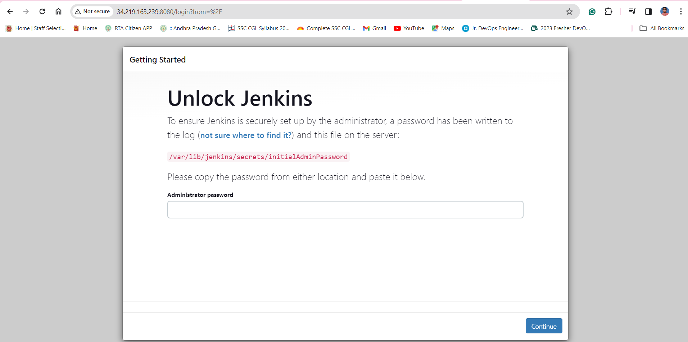

* Next we have to go the path mentioned in the page and get the password to login.
  
    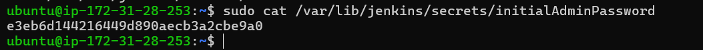
    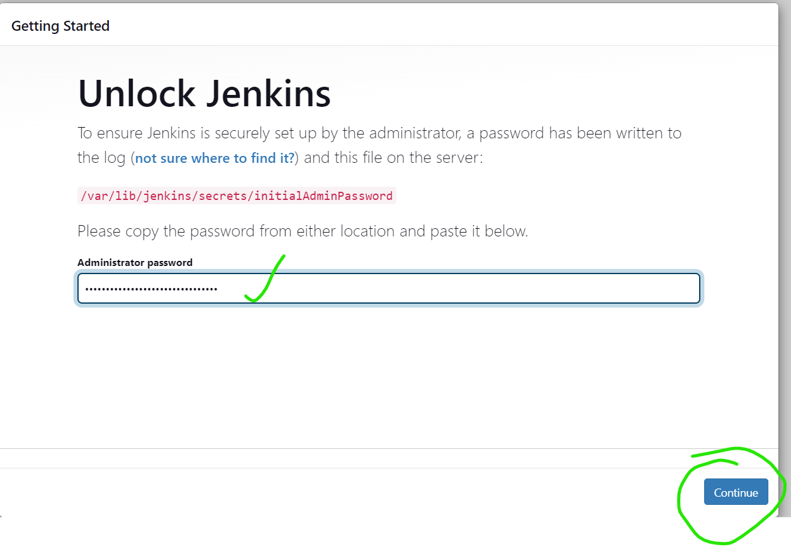

* Install plugins you can select the plugins or else you can install the suggested plugins.
   
    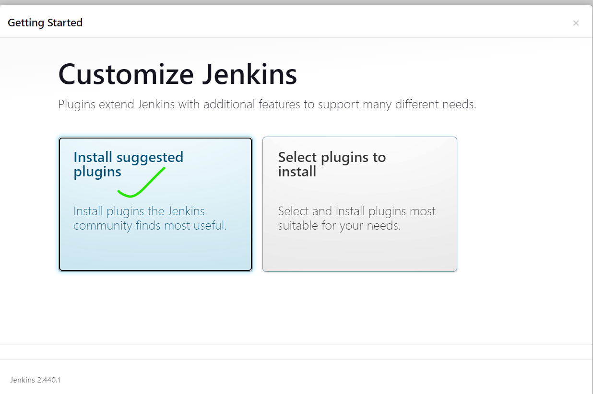

* Create an admin user.
  
    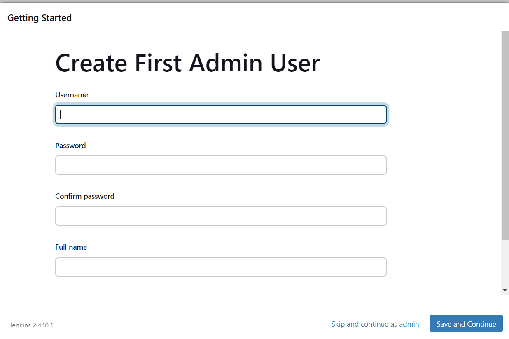
    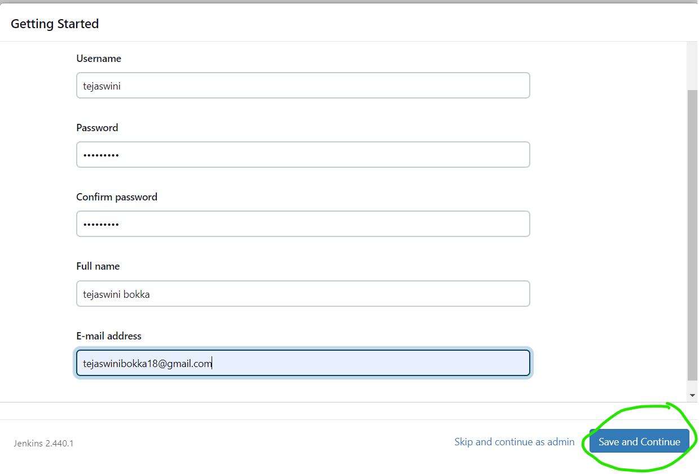
    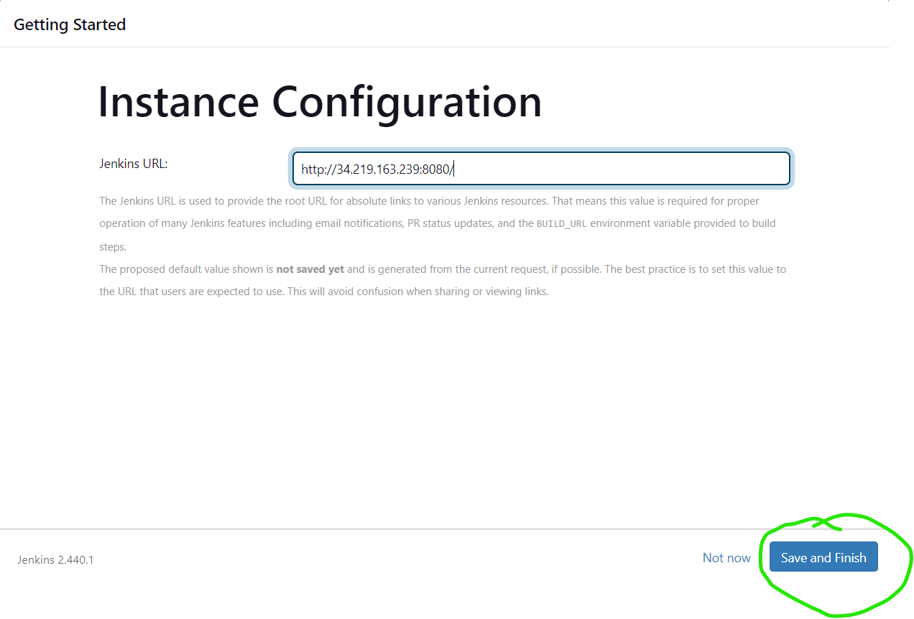

* After setting up that now we can see the dashboard.  

    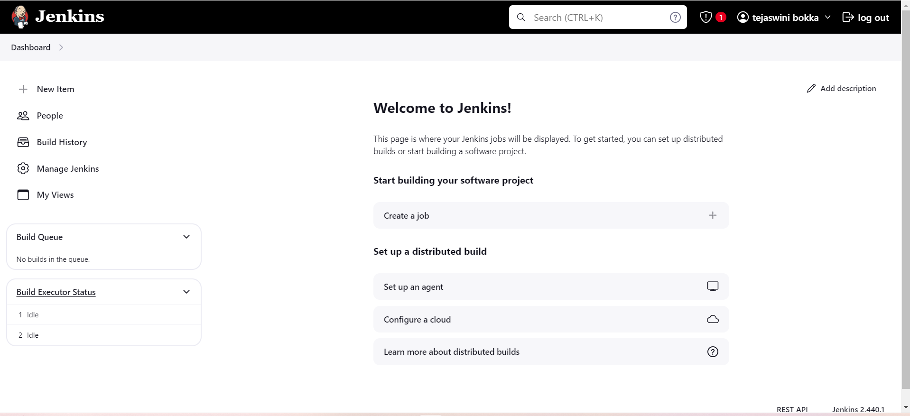
 